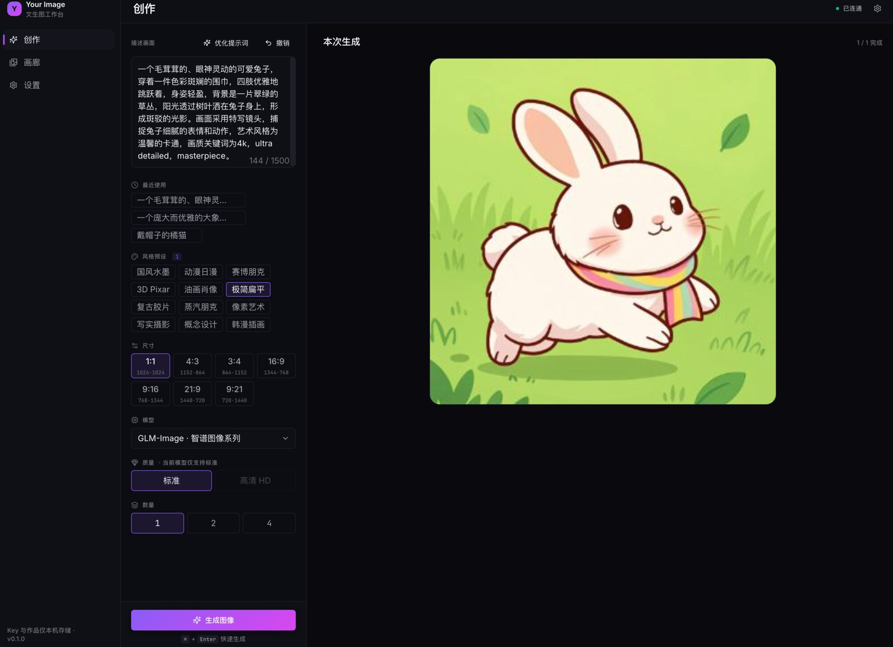
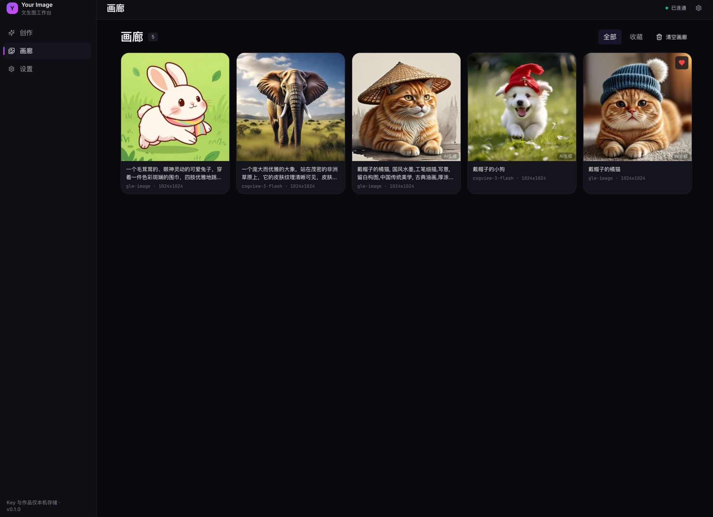
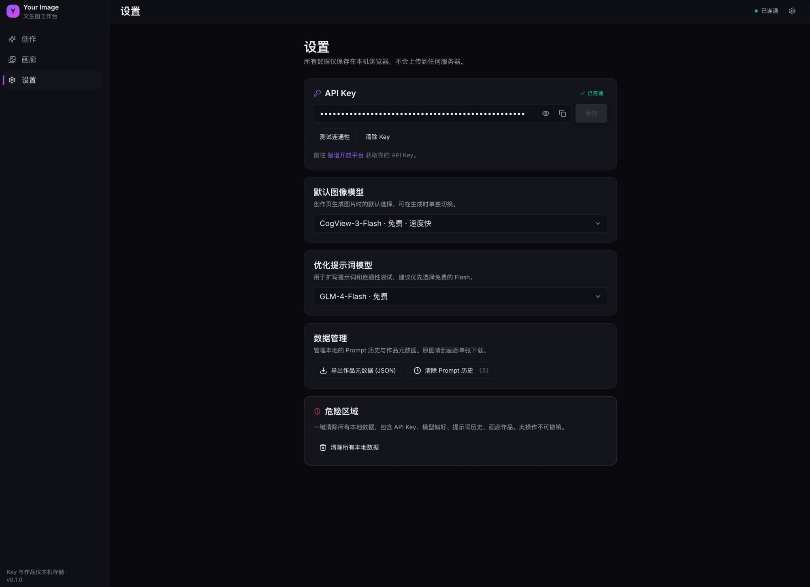

# Your Image

> 基于智谱 CogView / GLM 系列的本地 AI 文生图工作台。
> 单页应用 · 自带 API Key · 作品仅存本机 · 不登录、不上云。

[](LICENSE)
[](https://vitejs.dev)
[](https://react.dev)
[](https://www.typescriptlang.org)
[](https://tailwindcss.com)

---

## ✨ 特性

- **文生图**：支持 CogView-3-Flash（免费）/ CogView-4 / CogView-4-250304 / GLM-Image
- **✨ 优化提示词**：一键让 GLM-4-Flash 把简短描述扩写成详尽的视觉化 prompt
- **风格预设**：12 种内置风格（国风水墨 / 动漫 / 赛博朋克 / 3D Pixar / 油画 / 像素艺术 / 写实摄影 ...）可叠加
- **Prompt 历史**：自动记录最近 50 条，chip 一键复用
- **批量生成**：每次 1 / 2 / 4 张并发（免费模型自动串行避免 429）
- **本地画廊**：IndexedDB 存储 Blob，浏览 / 下载 / 收藏 / 再生成
- **Lightbox**：键盘 ← → 翻图、Esc 关闭
- **零后端**：API Key 仅 localStorage，请求直连智谱开放平台

---

## 🖼️ 界面预览

> 截图占位：把你跑起来的页面截图放到 `docs/screenshots/` 目录下并以下面的文件名命名即可在 README 中自动展示。

| 创作页 | 画廊 | 设置 |
|---|---|---|
|  |  |  |

**创作页布局**（参考）：

```
┌──────┬─────────────────────────┬──────────────────────────────────┐
│ Side │  ParamsPanel  360px     │  ResultsArea (flex 1)            │
│ bar  │                         │                                  │
│      │  [Prompt + ✨ 优化]     │   ┌─────┬─────┐                  │
│  ✦   │  [最近使用 chip]        │   │ img │ img │  网格 1 / 2×2    │
│  ▥   │  [风格预设 chip grid]   │   ├─────┼─────┤                  │
│  ⚙   │  [尺寸 · 模型 · 数量]   │   │ img │ img │                  │
│      │                         │   └─────┴─────┘                  │
│      │  ───────────────────    │                                  │
│      │  [⚡ 生成图像]          │   ⌘ + Enter 快速生成             │
└──────┴─────────────────────────┴──────────────────────────────────┘
```

---

## 🚀 快速开始

```bash
pnpm install
pnpm dev
# 打开 http://127.0.0.1:5173
```

首次启动后：
1. 进入「设置」页
2. 粘贴你的智谱 API Key（[从这里获取](https://bigmodel.cn/usercenter/proj-mgmt/apikeys)）
3. 点「测试连通性」，看到绿色「已连通」即可开始创作

---

## 🧰 技术栈

| 层 | 选型 |
|---|---|
| 构建 | Vite 6 |
| 框架 | React 18 + TypeScript 5 |
| 样式 | Tailwind CSS 3 |
| 状态 | Zustand |
| 路由 | React Router 6 |
| 存储 | IndexedDB（idb 包）+ localStorage |
| 图标 | lucide-react |
| 动效 | framer-motion |
| Toast | sonner |

---

## 📁 项目结构

```
src/
├── pages/                # Create / Gallery / Settings 三个主页面
├── components/
│   ├── ui/               # Button / Input / Select / ConfirmDialog
│   ├── layout/           # Sidebar / TopBar / ConnectionStatusDot
│   ├── prompt/           # PromptInput / OptimizeButton / StylePresetsBar / PromptHistoryChips
│   ├── params/           # SizeSelector / ModelSelector / QualityToggle / CountSelector
│   ├── results/          # ResultGrid / ResultCard / Lightbox
│   └── feedback/         # ErrorBoundary
├── lib/
│   ├── api/              # zhipu 通用封装 + cogview / glm-chat
│   ├── store/            # settings / gallery / tasks / prompt-history
│   ├── presets/          # 风格预设
│   ├── utils/            # cn / id / image / download / concurrency / export
│   └── db.ts             # IndexedDB 包装
├── types/                # 全局类型
└── styles/globals.css    # Tailwind 入口 + 主题变量
vite-plugins/
└── image-proxy.ts        # dev/preview 服务器图片代理（解决 CDN CORS）
docs/
├── PRD.md                # 产品需求
├── ARCHITECTURE.md       # 技术架构
├── DEV_PLAN.md           # 开发计划
├── DESIGN.md             # 视觉设计系统
└── screenshots/          # 界面截图（放图就行，README 自动引用）
```

---

## 🔐 隐私与数据

- **API Key**：仅保存在浏览器 localStorage，不会上传到任何服务器
- **生成作品**：以 Blob 形式存于浏览器 IndexedDB，永不外传
- **CSP**：限制只能连接智谱开放平台与其 CDN，无任何第三方追踪
- **导出**：设置页可一键导出作品元数据 JSON 作为备份（不含图片本身）
- **清除**：设置页提供「清除 Prompt 历史」「清除所有本地数据」两档清理

---

## ⚙️ 关键设计决策

### 图片 CDN 代理

智谱 `/images/generations` 返回的 URL 落在 UCloud 对象存储（`*.ufileos.com`），**不返回 CORS 头**，浏览器无法直接 fetch 拿到 Blob。
项目提供四份等价的代理实现，全部监听同一路径 `/api/img?url=...`：

| 环境 | 文件 |
|---|---|
| 本地 dev / preview | [vite-plugins/image-proxy.ts](vite-plugins/image-proxy.ts) |
| Vercel | [api/img.ts](api/img.ts)（Edge Function） |
| Docker / 自托管 Node | [server/index.mjs](server/index.mjs)（Hono） |
| Cloudflare Pages | [functions/api/img.ts](functions/api/img.ts)（Pages Function） |

四者都把图片从智谱 CDN 拉回并附加 `Access-Control-Allow-Origin: *`，仅放行 `*.bigmodel.cn` / `*.ufileos.com` 两族域名。前端不需要关心环境差异。

### 免费模型并发限制

免费的 `cogview-3-flash` 有较严格的 QPS 限制，并发 ≥ 2 几乎一定撞 429。前端按模型限制并发：

| 模型 | 并发上限 |
|---|---|
| cogview-3-flash | 1（串行） |
| cogview-4 / cogview-4-250304 | 2 |
| glm-image | 2 |

外加 1.5s → 4.5s 的指数退避自动重试，瞬时 429 用户感知不到。

### 30 天 URL 过期

智谱返回的 URL 30 天过期。生成成功后立即 fetch 转 Blob 写入 IndexedDB，作品永久保存在本地不依赖远程 URL。

---

## ⌨️ 快捷键

| 上下文 | 快捷键 | 作用 |
|---|---|---|
| Prompt 框内 | `⌘ / Ctrl + Enter` | 提交生成 |
| Lightbox | `←` / `→` | 上一张 / 下一张 |
| Lightbox | `Esc` | 关闭 |

---

## 📦 构建

```bash
pnpm build       # 产物输出到 dist/
pnpm preview     # 本机预览构建产物（含图片代理）
pnpm start       # 用 Node 服务运行 dist/（含图片代理，监听 :3000）
```

产物体积（gzipped）：约 130 KB JS / 5 KB CSS。

---

## 🚢 部署

> 不论部署到哪里，都必须保证 `/api/img` 这个路径由对应环境的代理实现处理，否则浏览器 fetch 智谱 CDN 会因 CORS 失败。本项目同时提供 Vercel Edge / Node / Cloudflare 三套等价实现。

### Vercel（推荐 · 零配置）

直接在 Vercel 导入这个 GitHub 仓库：

- 框架预设：自动识别为 Vite
- Build Command：`pnpm build`
- Output Directory：`dist`
- Edge Function：[`api/img.ts`](api/img.ts) 自动挂在 `/api/img`

部署完成后访问站点，在「设置」里填入智谱 API Key 即可使用。

### Docker（自托管）

仓库自带 Dockerfile + docker-compose.yml，使用 Node 22 + Hono 提供静态资源与代理。

```bash
# 一键起服务（端口 3000）
docker compose up -d --build

# 自定义端口
YOUR_IMAGE_PORT=8080 docker compose up -d --build

# 关闭
docker compose down
```

或不用 compose：

```bash
docker build -t your-image:latest .
docker run -d --name your-image -p 3000:3000 your-image:latest
```

镜像采用三段式多阶段构建，运行时基于 `node:22-alpine`，约 **120 MB**。
服务运行在 [`server/index.mjs`](server/index.mjs)，无 root 用户、含健康检查。

### Cloudflare Pages（边缘 · 全球加速）

把仓库连到 Cloudflare Pages，Build 设置如下：

| 项 | 值 |
|---|---|
| Build command | `pnpm build` |
| Build output directory | `dist` |
| Node version | `22` |

[`functions/api/img.ts`](functions/api/img.ts) 会被自动识别为 Pages Function，挂在 `/api/img` 路径下。

### 其它静态托管（Netlify / S3 / 自建 Nginx）

把 `dist/` 上传作为静态站，**额外**需要一个能处理 `/api/img?url=...` 的代理：

- Netlify：把 [`api/img.ts`](api/img.ts) 适配到 `netlify/edge-functions/img.ts`
- AWS：S3 + CloudFront + Lambda@Edge
- Nginx：使用 njs 或 OpenResty 转写 query 参数后 `proxy_pass`

只要响应路径仍是 `/api/img`、返回 `Access-Control-Allow-Origin: *`，前端不用改一行代码。

---

---

## 🛣️ Roadmap

- **v1（当前）**：文生图 + 优化提示词 + 风格预设 + 本地画廊
- **v2（待智谱开放原生 API 后跟进）**：图生图 / AI 抠图 / Inpainting / Outpainting / 指令式编辑
- **v2+**：多模型对比 · 自定义风格预设 · 视频生成（CogVideoX）

---

## 📂 文档

完整设计文档位于 [`docs/`](docs/) 目录：

- [产品需求 PRD](docs/PRD.md)
- [技术架构](docs/ARCHITECTURE.md)
- [开发计划](docs/DEV_PLAN.md)
- [视觉设计系统](docs/DESIGN.md)
- [更新日志 CHANGELOG](CHANGELOG.md)

---

## 🤝 贡献

欢迎 issue 与 PR。提交前请保证：

```bash
node_modules/.bin/tsc --noEmit   # 类型零错误
pnpm build                       # 构建通过
```

---

## 📄 License

[MIT](LICENSE) © 2026 maya1900
